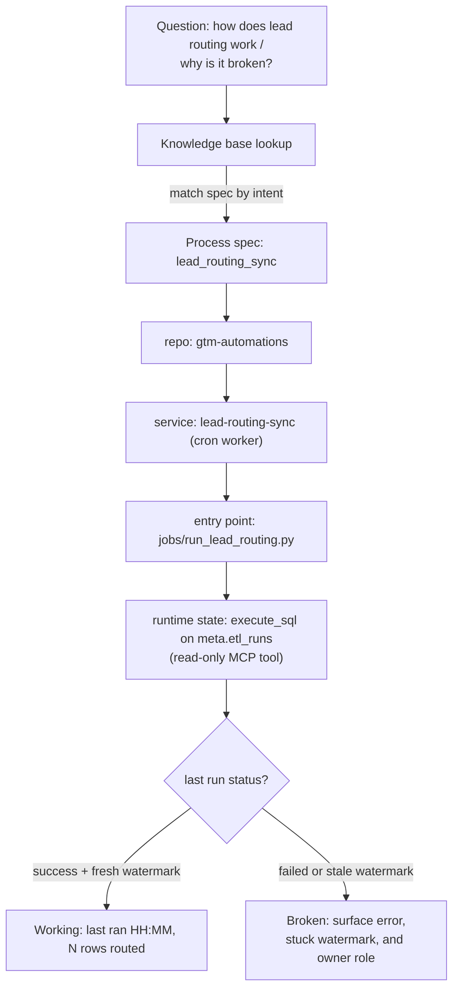

<!-- Illustrative sample - genericized, not production code. -->

# Dual-Audience Process Spec (illustrative)

This is a generic example of one process spec in the knowledge base. Every automation
gets one. It has two layers: a plain-English summary humans read, and a machine-readable
technical block the process-tracer agent resolves against. The real specs cover proprietary
automations and carry a much longer technical reference; this skeleton shows the shape.

## Layer 1 - Plain-English summary (human audience)

**Lead Routing Sync** keeps inbound leads flowing to the right owner. On a schedule (and on
a create webhook), it pulls new leads from the CRM, enriches them with firmographics, scores
them against the team's written rules of engagement, and assigns an owner. If a lead cannot
be routed, it lands in a review queue. If this "feels broken," the usual symptom is leads
sitting unassigned, which almost always traces back to a failed or stale sync run.

## Layer 2 - Machine-readable technical block (agent audience)

```json
{
  "spec_id": "lead_routing_sync",
  "version": "1.4.0",
  "summary": "Enriches and routes inbound CRM leads to an owner on a schedule and on create.",
  "repo": "gtm-automations",
  "service": {
    "name": "lead-routing-sync",
    "platform": "render",
    "type": "cron_worker",
    "schedule_cron": "*/15 * * * *"
  },
  "entry_point": "jobs/run_lead_routing.py",
  "triggers": [
    { "kind": "schedule", "detail": "every 15 minutes" },
    { "kind": "webhook", "detail": "crm.lead.created" }
  ],
  "dependencies": [
    { "name": "crm_api", "role": "source + write-back owner assignment" },
    { "name": "enrichment_api", "role": "firmographic enrichment" },
    { "name": "analytics_db", "role": "read routing rules, write run metrics" }
  ],
  "runtime_state": {
    "store": "meta.etl_runs",
    "lookup": "latest row where job_name = 'lead_routing_sync'",
    "healthy_when": "status = 'success' AND watermark within last 30 min",
    "fields": ["status", "started_at", "finished_at", "rows_processed", "watermark", "error"]
  },
  "owner_role": "RevOps systems owner",
  "source_articles": 6,
  "last_reviewed": "2026-06-30",
  "config": {
    "note": "All credentials are read from environment variables at runtime, never stored in the spec.",
    "env": ["CRM_TOKEN", "ENRICHMENT_API_KEY", "DATABASE_URL"]
  }
}
```

## How the process-tracer resolves a question

A question like "how does lead routing work?" or "why are leads not getting assigned?"
walks the same fixed chain. The agent finds the matching spec, follows it to the repo,
service, and entry point, then reads live runtime state through a read-only MCP tool
(`execute_sql` against `meta.etl_runs`) to decide "working" versus "broken, and why."



Plain-text version of the same resolution chain:

```
question
  -> knowledge base lookup (match spec by intent)
  -> spec: lead_routing_sync
  -> repo: gtm-automations
  -> service: lead-routing-sync (cron worker)
  -> entry point: jobs/run_lead_routing.py
  -> runtime state: meta.etl_runs latest row (via read-only MCP execute_sql)
  -> verdict: working (fresh success) OR broken (error + stale watermark + owner)
```
